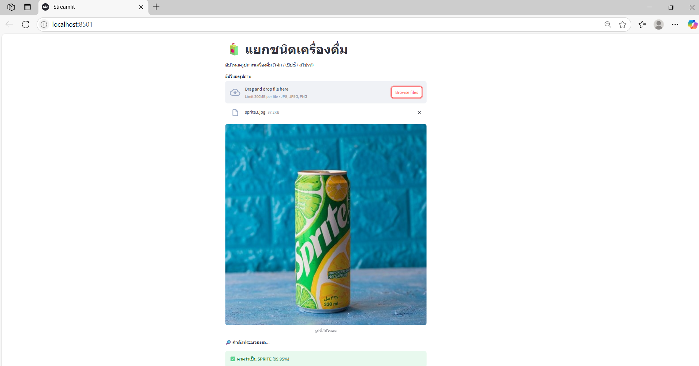

# 🧃 Drink Classification Project (โค้ก / เป๊ปซี่ / สไปรท์) 🍹
โปรเจกต์นี้เป็นระบบจำแนกประเภทเครื่องดื่ม 3 ชนิด ได้แก่ โค้ก, เป๊ปซี่ และสไปรท์ 🥤 โดยใช้โมเดลปัญญาประดิษฐ์ (AI) ที่ฝึกด้วยชุดข้อมูลเฉพาะ ผ่านแพลตฟอร์ม BDH X-Brain และพัฒนาแอปพลิเคชันด้วย Streamlit เพื่อให้ผู้ใช้สามารถอัปโหลดภาพเครื่องดื่มและรับผลลัพธ์ได้ทันทีผ่านเว็บแอป 🌐✨

## 📋 เนื้อหาในโปรเจกต์ 📁
- `app.py` - เว็บแอปหลักที่ใช้ Streamlit สำหรับอัปโหลดภาพและแสดงผลลัพธ์การจำแนก 🖼️➡️🤖
- `train.py` - สคริปต์สำหรับฝึกโมเดล AI ด้วยชุดข้อมูลที่เตรียมไว้ 🏋️‍♂️
- `predict.py` - สคริปต์สำหรับทำการทำนายด้วยโมเดลที่ฝึกเสร็จแล้ว (เรียกใช้นอกแอป) 🔍
- `model/` - โฟลเดอร์เก็บโมเดลที่ฝึกเสร็จแล้ว (`drink_classification.pth`) 📂
- `test_images/` - โฟลเดอร์ตัวอย่างภาพทดสอบสำหรับทดลองรันโมเดล 🖼️
- `requirements.txt` - รายการไลบรารี Python ที่ต้องติดตั้ง 📦
- `README.md` - ไฟล์นี้ 📄

## ⚙️ การติดตั้งและใช้งาน 🛠️
1. **ติดตั้ง Python 3.8+** 🐍  
   ดาวน์โหลดและติดตั้งได้ที่ [python.org](https://www.python.org/downloads/)
2. **โคลนโปรเจกต์นี้** 📥  
   git clone https://github.com/AI-Challenge-2025/drink-classification_Patchareeporn.git
   cd drink-classification_Patchareeporn
3. **ติดตั้งไลบรารีที่จำเป็น** 📚
ใช้คำสั่งนี้เพื่อติดตั้ง dependencies ที่ระบุใน requirements.txt
    pip install -r requirements.txt
4. **ทดสอบรันเว็บแอปด้วย Streamlit** 🚀
รันคำสั่งนี้ในเทอร์มินัล
    streamlit run app.py
จากนั้นเปิดเว็บเบราว์เซอร์ไปที่ URL ที่แสดง (โดยปกติจะเป็น http://localhost:8501)
5. **ทดสอบการทำนายด้วยสคริปต์** predict.py 🧪
ใช้คำสั่งนี้เพื่อทดสอบไฟล์ภาพ
    python predict.py test_images/coke1.jpg
(เปลี่ยนพาธไฟล์ภาพตามต้องการ)

## 🗂️ ชุดข้อมูลและการฝึกโมเดล 📷🤖
- ชุดข้อมูลภาพเครื่องดื่มถูกเก็บรวบรวมและแบ่งเป็น 3 ประเภท (โค้ก, เป๊ปซี่, สไปรท์) โดยใช้ภาพถ่ายจริงและภาพจากแหล่งสาธารณะ
- ใช้เทคนิคการประมวลผลภาพเบื้องต้น เช่น การปรับขนาดภาพ และการเพิ่มข้อมูล (data augmentation) เพื่อเพิ่มความหลากหลายของข้อมูลฝึก
- โมเดลถูกฝึกบนแพลตฟอร์ม BDH X-Brain ซึ่งช่วยให้สร้างและฝึกโมเดล AI ได้ง่ายและรวดเร็ว ⚙️
- โมเดลที่ได้จะถูกบันทึกเป็นไฟล์ drink_classification.pth ในโฟลเดอร์ model/ 💾

## 📊 การประเมินผลโมเดล 📈
- โมเดลนี้ทำความแม่นยำ (Accuracy) บนชุดทดสอบได้ประมาณ xx.xx% (กรุณาแทนค่าตามผลจริง)
- เมตริกอื่น ๆ เช่น Precision, Recall และ F1-Score สามารถวัดและปรับปรุงได้โดยการเพิ่มข้อมูลฝึกหรือปรับแต่งโมเดลเพิ่มเติม
- การทดสอบด้วยภาพใหม่ ๆ แสดงผลลัพธ์ที่น่าพอใจและเหมาะสมสำหรับการใช้งานจริง 🎉

## 🧰 เครื่องมือและเทคโนโลยีที่ใช้ 🖥️
- **Python 3.8+** 🐍 - ภาษาโปรแกรมหลัก
- **Streamlit** 🌐 - สำหรับสร้างเว็บแอปใช้งานง่าย
- **PyTorch** 🔥 - ไลบรารีหลักสำหรับสร้างและฝึกโมเดล AI
- **BDH X-Brain** 🤖 - แพลตฟอร์ม no-code/low-code สำหรับเทรนโมเดล AI
- **Pillow (PIL)** 🖼️ - จัดการรูปภาพใน Python
- **OpenCV** 📸 - สำหรับการประมวลผลภาพเบื้องต้น (ถ้ามีใช้)

## 🤝 การอ้างอิงและที่มา 📚
1. **ชุดข้อมูลเครื่องดื่ม**
- ได้รับการรวบรวมและจัดเตรียมโดยผู้พัฒนาโปรเจกต์
- ภาพบางส่วนอาจมาจากแหล่งสาธารณะ (Public domain)
2. **BDH X-Brain**
- แพลตฟอร์มสำหรับสร้างและฝึกโมเดล AI แบบ no-code/low-code
- เว็บไซต์ BDH X-Brain
3. **Streamlit**
- เว็บเฟรมเวิร์กสำหรับสร้างแอป AI และ Data Science แบบง่าย
- Streamlit Documentation
4. **PyTorch**
- ไลบรารี AI ยอดนิยมสำหรับฝึกและใช้งานโมเดล
- PyTorch
5.**OpenCV**
- ไลบรารีสำหรับการประมวลผลภาพ
- OpenCV

📞 ติดต่อผู้พัฒนา 💌
- ชื่อ: พัชรีพร พฤฒิสาร
- รหัสนิสิต: 65050099
- อีเมล: ninilnarissara@gmail.com
- GitHub: https://github.com/AI-Challenge-2025/drink-classification_Patchareeporn